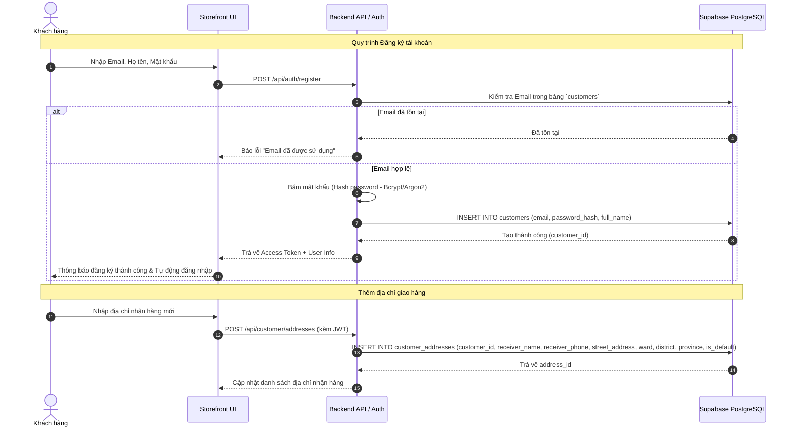
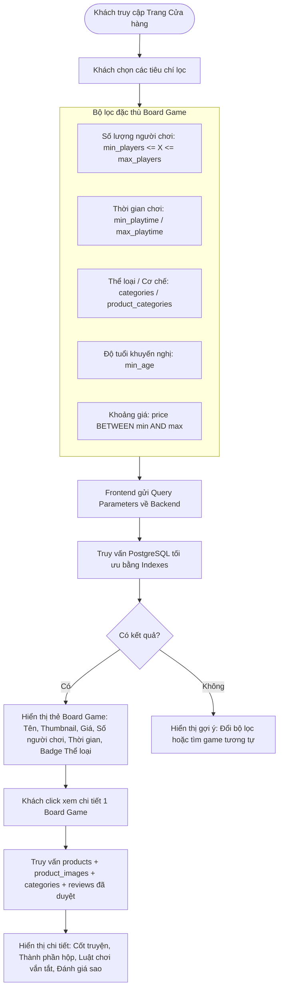
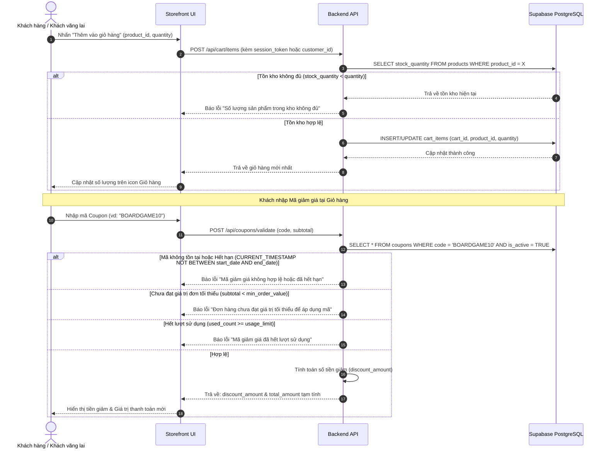
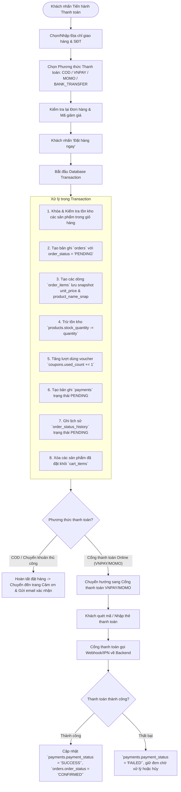
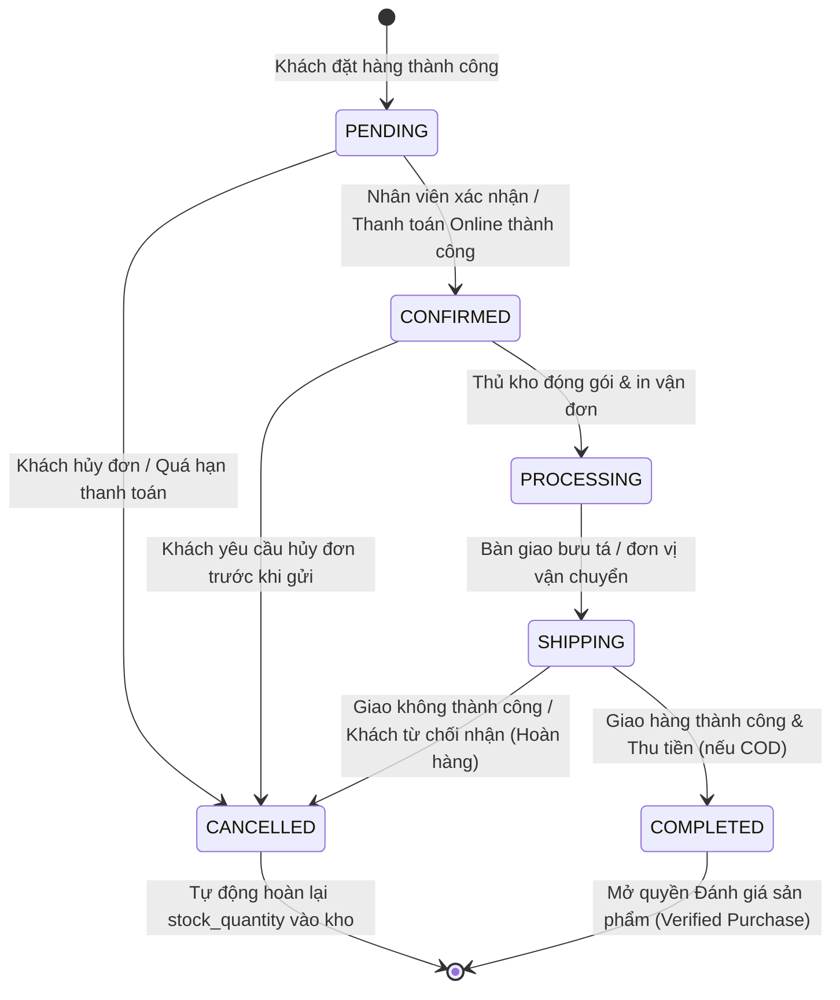
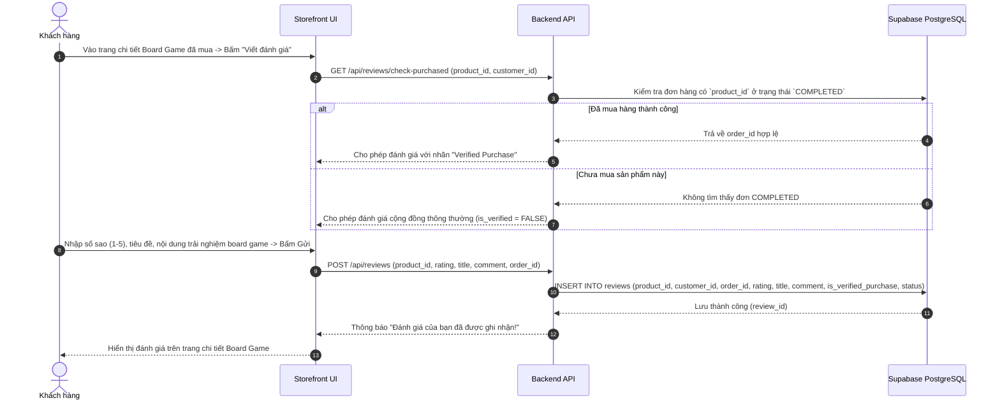

# TÀI LIỆU CÁC LUỒNG NGHIỆP VỤ HỆ THỐNG BOARDZONE (EC312)

Tài liệu này đặc tả chi tiết toàn bộ các luồng nghiệp vụ (Business Workflows) chính của hệ thống thương mại điện tử chuyên biệt về Board Game – **BoardZone**, bao gồm sơ đồ luồng (Flowchart), biểu đồ tuần tự (Sequence Diagram), các bước xử lý và tác động tới cơ sở dữ liệu tương ứng.

---

## MỤC LỤC

1. [Tổng quan các tác nhân (Actors) trong hệ thống](#1-tong-quan-cac-tac-nhan-actors-trong-he-thong)
2. [Luồng 1: Xác thực & Quản lý Tài khoản (Authentication & Account)](#luong-1-xac-thuc--quan-ly-tai-khoan-authentication--account)
3. [Luồng 2: Khám phá & Lọc Sản phẩm Board Game đa chiều](#luong-2-kham-pha--loc-san-pham-board-game-da-chieu)
4. [Luồng 3: Quản lý Giỏ hàng & Áp dụng Mã giảm giá (Cart & Coupon)](#luong-3-quan-ly-gio-hang--ap-dung-ma-giam-gia-cart--coupon)
5. [Luồng 4: Quy trình Đặt hàng & Thanh toán (Checkout & Payment)](#luong-4-quy-trinh-dat-hang--thanh-toan-checkout--payment)
6. [Luồng 5: Xử lý Đơn hàng & Quản lý Kho (Order Fulfillment & Inventory)](#luong-5-xu-ly-don-hang--quan-ly-kho-order-fulfillment--inventory)
7. [Luồng 6: Đánh giá & Phản hồi sau mua (Verified Review Flow)](#luong-6-danh-gia--phan-hoi-sau-mua-verified-review-flow)
8. [Bảng tổng hợp Ma trận Phân quyền & Tác động Dữ liệu](#8-bang-tong-hop-ma-tran-phan-quyen--tac-dong-du-lieu)

---

## 1. Tổng quan các tác nhân (Actors) trong hệ thống

- **Khách vãng lai (Guest):** Người dùng chưa đăng nhập, có thể duyệt xem sản phẩm, tìm kiếm, lọc theo thuộc tính game và tạo giỏ hàng tạm.
- **Khách hàng (Customer):** Người dùng đã đăng ký/đăng nhập tài khoản, quản lý địa chỉ nhận hàng, đặt hàng, theo dõi tiến trình đơn hàng và viết đánh giá sản phẩm đã mua.
- **Nhân viên bán hàng / Xử lý đơn (Staff):** Xác nhận đơn hàng, kiểm tra thanh toán, cập nhật trạng thái đóng gói và bàn giao giao vận.
- **Quản lý kho (Warehouse Manager):** Quản lý số lượng tồn kho (stock), nhập hàng, cập nhật SKU và thông số game.
- **Quản trị viên (Admin):** Quản lý toàn diện hệ thống: tài khoản nhân viên, danh mục, sản phẩm, chiến dịch khuyến mãi (Coupons) và duyệt đánh giá.

---

## Luồng 1: Xác thực & Quản lý Tài khoản (Authentication & Account)

### 1.1. Sơ đồ tuần tự Đăng ký & Đăng nhập Khách hàng

### 1.2. Các bảng CSDL tham gia
- `public.customers`
- `public.customer_addresses`
- `public.users` (dành riêng cho phân quyền nội bộ Admin/Staff)

---

## Luồng 2: Khám phá & Lọc Sản phẩm Board Game đa chiều

Khác với các mặt hàng thông thường, Board Game đòi hỏi bộ lọc đặc thù chuyên sâu nhằm giúp người chơi nhanh chóng tìm thấy tựa game phù hợp với nhóm của mình.

### 2.1. Sơ đồ xử lý Lọc & Tìm kiếm Board Game

### 2.2. Các bảng CSDL tham gia
- `public.products` (lọc nhanh nhờ `idx_products_players`, `idx_products_playtime`, `idx_products_price`)
- `public.categories`
- `public.product_categories`
- `public.product_images`
- `public.reviews`

---

## Luồng 3: Quản lý Giỏ hàng & Áp dụng Mã giảm giá (Cart & Coupon)

### 3.1. Sơ đồ tuần tự Thêm vào giỏ & Áp mã Voucher

### 3.2. Các bảng CSDL tham gia
- `public.carts`
- `public.cart_items`
- `public.products`
- `public.coupons`

---

## Luồng 4: Quy trình Đặt hàng & Thanh toán (Checkout & Payment)

### 4.1. Sơ đồ xử lý Đặt hàng (Checkout Flow)

### 4.2. Các bảng CSDL tham gia
- `public.orders`
- `public.order_items` (lưu **snapshot** bảo vệ toàn vẹn lịch sử giao dịch khi giá sản phẩm gốc thay đổi)
- `public.payments`
- `public.order_status_history`
- `public.products`
- `public.coupons`
- `public.cart_items`

---

## Luồng 5: Xử lý Đơn hàng & Quản lý Kho (Order Fulfillment & Inventory)

### 5.1. Vòng đời Trạng thái Đơn hàng (Order State Machine)

### 5.2. Các bước tác động dữ liệu khi Đơn hàng thay đổi trạng thái
1. **Chuyển sang `PROCESSING` / `SHIPPING`:**
   - Nhân viên cập nhật trên Dashboard Quản trị.
   - Thêm bản ghi vào `order_status_history` ghi lại `changed_by_user_id`, `status_from`, `status_to`, thời điểm và ghi chú giao vận.
2. **Khi đơn hàng bị HỦY (`CANCELLED`):**
   - Hệ thống tự động hoàn lại tồn kho: `UPDATE products SET stock_quantity = stock_quantity + quantity`.
   - Nếu có dùng voucher: giảm lượt dùng `UPDATE coupons SET used_count = used_count - 1`.
   - Ghi nhận lịch sử hủy vào `order_status_history`.

---

## Luồng 6: Đánh giá & Phản hồi sau mua (Verified Review Flow)

Nhằm đảm bảo tính khách quan và uy tín cho cộng đồng chơi Board Game, hệ thống ưu tiên các nhận xét từ người đã thực sự mua hàng.

### 6.1. Sơ đồ tuần tự Đánh giá sản phẩm

---

## 8. Bảng tổng hợp Ma trận Phân quyền & Tác động Dữ liệu

| Phân hệ / Bảng dữ liệu | Khách vãng lai (Guest) | Khách hàng (Customer) | Nhân viên (Staff) | Quản lý kho (Warehouse) | Quản trị viên (Admin) |
| :--- | :---: | :---: | :---: | :---: | :---: |
| **`products`, `categories`** | Chỉ Đọc (Xem/Lọc) | Chỉ Đọc (Xem/Lọc) | Chỉ Đọc | Đọc / Cập nhật tồn kho | Toàn quyền (CRUD) |
| **`carts`, `cart_items`** | Tạo/Sửa (Session) | Tạo/Sửa (User ID) | Không | Không | Xem báo cáo |
| **`coupons`** | Nhập áp dụng | Nhập áp dụng | Tra cứu mã | Không | Toàn quyền (Tạo/Sửa) |
| **`orders`, `order_items`** | Không | Tạo đơn / Xem đơn của mình | Duyệt đơn / Cập nhật trạng thái | Xem để xuất kho | Toàn quyền |
| **`payments`** | Không | Khởi tạo khi checkout | Đối soát giao dịch | Không | Toàn quyền |
| **`reviews`** | Chỉ Đọc | Viết nhận xét game | Ẩn review vi phạm | Không | Kiểm duyệt / Xóa |
| **`users`** | Không | Không | Xem thông tin cá nhân | Xem thông tin cá nhân | Toàn quyền quản trị nhân sự |
